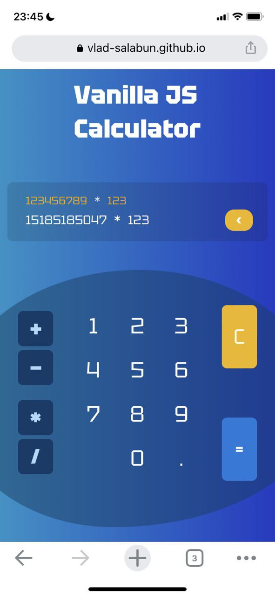
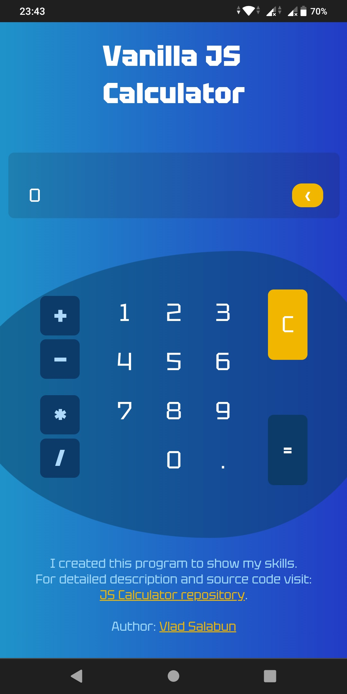
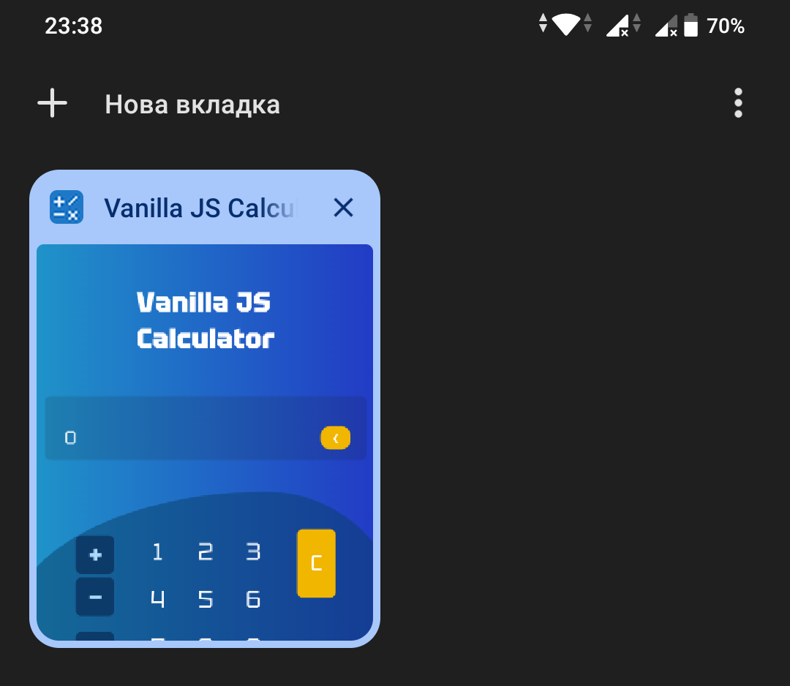
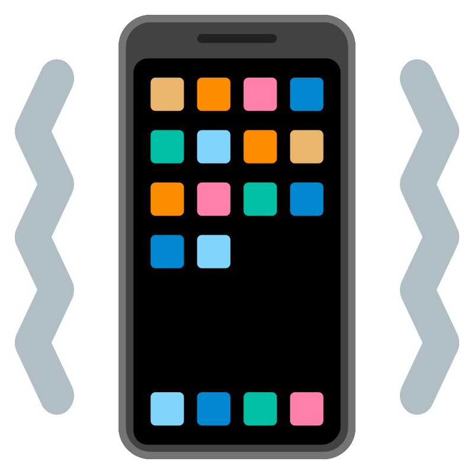

<h1 align="center">This is calculator written in JavaScript  without any libraries or frameworks</h1>

Demo:
<a href="https://vlad-salabun.github.io/js-calculator" target="_blank">https://vlad-salabun.github.io/js-calculator</a>

----------

I didn't use <code>eval()</code> function becouse "eval is evil".
<picture></picture>
<picture></picture> 
For bundle all files together I use WebPack.

<picture>
    
</picture>
<picture>
    
</picture>
<picture>
    
</picture>
<picture>
    
</picture>

This calculator is very simple and has a nice aesthetic look. 
This is how it looks on  iOS:

<picture></picture>

<picture></picture>

And this is how it looks on Android:

<picture></picture>

<picture></picture>

And I also created a favicon. Here she is:

<picture></picture>

The favicon looks good on all devices.
Here's how on PC in Chrome:

<picture></picture>

<picture></picture>

And on a mobile device it looks like this:

<picture></picture>

<picture>

</picture>
 To make it more pleasant to use, I added vibration when pressing the buttons. It works for android, but unfortunately still not supported for iOS. I'm very sorry, I hope apple fixes this, because it's a nice feature.

<picture></picture>
  
And for convenient input from a PC, I added keyboard support. Hope you enjoy it.

 

----------

<picture></picture>

Thank you for looking at my work! 
Author: <a href="https://vlad-salabun.github.io">Vlad Salabun</a>

----------
